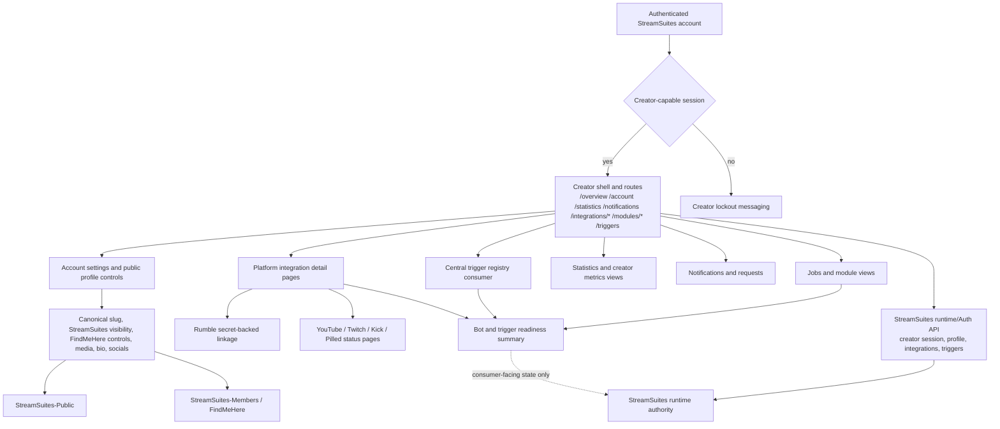

# StreamSuites-Creator

Creator-facing StreamSuites surface deployed to Cloudflare Pages at `https://creator.streamsuites.app`.

## Release State

- README state prepared for `v0.4.2-alpha`.
- Runtime-displayed version/build labels are consumed from `https://admin.streamsuites.app/runtime/exports/version.json`.
- This repo is a static frontend that hydrates from authoritative runtime and Auth API services and does not own backend state.
- Cloudflare deep-link handling now uses only valid exact route rewrites for Creator shell paths, plus a route-scoped Pages Function fallback for the same known paths, so nested Creator URLs no longer depend on invalid wildcard rewrites being honored.

## Scope & Authority

- This repo is the creator-facing dashboard shell, not a backend authority.
- Session, role, tier, public-profile policy, trigger registry, integration posture, and readiness evaluation remain runtime/Auth-owned in `StreamSuites`.
- The creator UI is allowed to initiate supported account and integration workflows, but it must stay within the backend contracts that already exist.
- Public profile and FindMeHere outcomes shown here are authoritative reflections of runtime/Auth state, not creator-local truth.

## Repo-Scoped Flowchart



## Current Surface Model

- Clean path-based creator routes are the primary navigation model, with Cloudflare Pages deep-link handling anchored in the root `_redirects` and a route-scoped `functions/[[path]].js` fallback for valid shell routes that would otherwise 404 on direct entry or refresh.
- The Creator repo no longer uses `*_splat -> /index.html*` SPA rewrites for shell routing because Cloudflare/Wrangler treats those wildcard-to-shell rules as invalid loop candidates. Known Creator shell entry points are now enumerated explicitly in `_redirects`, while real misses still fall through to the branded `404.html`.
- Legacy hash-fragment and older `/platforms/*` compatibility remains in the client router, but canonical creator links now use path routes such as `/overview`, `/account`, `/statistics`, `/notifications`, `/integrations/...`, and `/modules/...`.
- The `/account` route is the authoritative creator-facing profile control surface for supported fields exposed by the public profile API.
- The `/settings` route is now the creator-facing Preferences surface for moderator assignment and future community controls that remain grounded in runtime-owned contracts.
- The account route now keeps integrations as a compact snapshot and link-out surface rather than the primary control center.
- A dedicated `/integrations` hub now acts as the full-page creator readiness surface, while per-platform routes carry the actionable setup and management workflows.
- Creator media editing now prefers upload-from-device for avatar and cover updates while preserving manual URL inputs as secondary paths.
- Creator account settings currently surface canonical slug editing and visibility, StreamSuites public profile visibility, FindMeHere listing controls, truthful dual share previews, reserved media fields including background image URL, bio/about, grounded public social links, and a small pointer over to Preferences for moderator/community controls.
- Creator Preferences currently surface creator-scoped moderator assignment, moderator lookup, moderator removal, and clear scope messaging backed by the authoritative runtime/API relationship model.
- The updated account/settings layout includes the recent typography and polish work where the current UI already reflects it.
- Notifications, statistics, onboarding, and Discord bot install panels remain consumers of backend-owned data and permissions.

## Auth and Boundaries

- Session and auth state are runtime/Auth API owned.
- Creator login surfaces now consume `/auth/access-state` and the short-lived `/auth/debug/unlock` bypass flow so runtime maintenance or development mode can gate new auth starts without disrupting existing valid sessions.
- Authenticated creator access is required for dashboard surfaces.
- Non-creator authenticated sessions are soft-locked out rather than treated as creator-authoritative.
- No admin mutation endpoints are authored here.

## Creator Accounts, Integrations, and Trigger Foundation

- This phase keeps `StreamSuites-Creator` as a static consumer of runtime/Auth truth for creator account posture, platform integrations, and the first centralized trigger registry pass.
- The account/settings route now summarizes authoritative platform linkage state instead of inventing local platform truth.
- Dedicated platform routes consume per-platform integration detail from runtime/Auth and use safe messaging for providers that are still planned or unavailable.
- Rumble is the only creator-managed credential path in this phase, and it uses a backend-owned secret save/remove flow that returns masked presence state only.
- The triggers route now consumes the central runtime/Auth trigger registry foundation, seeded with minimal built-ins and only low-risk enabled-state management.

The flowchart above keeps the creator repo grounded in its current contract-consumer role. It expands the earlier foundation diagram without implying local ownership of readiness, trigger execution, or profile authority.

## Cross-Repo Orientation

- Top-level authority map: [StreamSuites runtime README](https://github.com/BSMediaGroup/StreamSuites)
- Admin-surface detail: [StreamSuites-Dashboard README](https://github.com/BSMediaGroup/StreamSuites-Dashboard)
- Public-surface detail: [StreamSuites-Public README](https://github.com/BSMediaGroup/StreamSuites-Public)
- FindMeHere detail: [StreamSuites-Members README](https://github.com/BSMediaGroup/StreamSuites-Members)

## Repository Structure (Abridged, Accurate)

```text
StreamSuites-Creator/
├── .gitignore
├── _redirects
├── 404.html
├── BUMP_NOTES.md
├── CNAME
├── COMMERCIAL-LICENSE-NOTICE.md
├── EULA.md
├── LICENSE
├── README.md
├── favicon.ico
├── index.html
├── changelog/
│   └── v0.4.2-alpha.md
├── scripts/
│   └── validate-pages-routing.ps1
├── login/
│   └── index.html
├── login-success/
│   └── index.html
├── functions/
│   ├── _shared/
│   │   └── auth-api-proxy.js
│   ├── auth/
│   │   └── [[path]].js
│   ├── [[path]].js
│   └── oauth/
│       └── [[path]].js
├── assets/
│   ├── css/
│   │   └── ss-profile-hovercard.css
│   ├── js/
│   │   └── ss-profile-hovercard.js
│   └── [backgrounds, fonts, icons, illustrations, logos, placeholders, including icons/ui/ss-admin.svg, ss-creator.svg, ss-developer.svg, ss-public.svg]
├── css/
│   ├── base.css
│   ├── components.css
│   ├── creator-dashboard.css
│   ├── layout.css
│   ├── overrides.css
│   ├── status-widget.css
│   ├── theme-dark.css
│   └── updates.css
├── data/
│   ├── creators.json
│   ├── jobs.json
│   ├── platforms.json
│   └── runtime_snapshot.json
├── shared/
│   └── state/
│       ├── live_status.json
│       ├── quotas.json
│       ├── runtime_snapshot.json
│       └── discord/
│           └── runtime.json
├── js/
│   ├── account-settings.js
│   ├── app.js
│   ├── auth.js
│   ├── creator-moderators.js
│   ├── creator-stats.js
│   ├── discord-bot-integration.js
│   ├── integrations-hub.js
│   ├── jobs.js
│   ├── notifications.js
│   ├── onboarding.js
│   ├── platform-integration-detail.js
│   ├── routes.js
│   ├── settings.js
│   ├── state.js
│   ├── triggers.js
│   └── utils/
│       ├── notifications-store.js
│       ├── stats-formatting.js
│       ├── stats-svg-charts.js
│       ├── version-stamp.js
│       └── versioning.js
├── tests/
│   ├── auth-surface-links.test.mjs
│   └── notifications-authority.test.mjs
└── views/
    ├── account.html
    ├── integrations.html
    ├── jobs.html
    ├── notifications.html
    ├── onboarding.html
    ├── overview.html
    ├── plans.html
    ├── settings.html
    ├── statistics.html
    ├── triggers.html
    ├── updates.html
    ├── modules/
    │   ├── clips.html
    │   ├── livechat.html
    │   ├── overlays.html
    │   └── polls.html
    └── platforms/
        ├── discord.html
        ├── kick.html
        ├── pilled.html
        ├── rumble.html
        ├── twitch.html
        └── youtube.html
```
