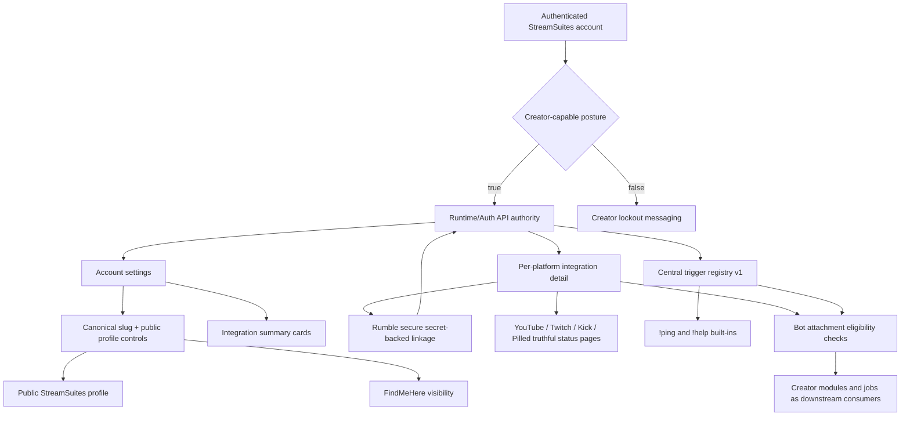

# StreamSuites-Creator

Creator-facing StreamSuites surface deployed to Cloudflare Pages at `https://creator.streamsuites.app`.

## Release State

- README state prepared for `v0.4.2-alpha`.
- Runtime-displayed version/build labels are consumed from `https://admin.streamsuites.app/runtime/exports/version.json`.
- This repo is a static frontend that hydrates from authoritative runtime and Auth API services and does not own backend state.

## Current Surface Model

- Clean path-based creator routes are the primary navigation model, with Cloudflare Pages deep-link handling in the root `_redirects`.
- Legacy hash-fragment and older `/platforms/*` compatibility remains in the client router, but canonical creator links now use path routes such as `/overview`, `/account`, `/statistics`, `/notifications`, `/integrations/...`, and `/modules/...`.
- The account/settings experience is the authoritative creator-facing profile control surface for supported fields exposed by the public profile API.
- Creator account settings currently surface canonical slug editing and visibility, StreamSuites public profile visibility, FindMeHere listing controls, truthful dual share previews, reserved media fields including background image URL, bio/about, and grounded public social links.
- The updated account/settings layout includes the recent typography and polish work where the current UI already reflects it.
- Notifications, statistics, onboarding, and Discord bot install panels remain consumers of backend-owned data and permissions.

## Auth and Boundaries

- Session and auth state are runtime/Auth API owned.
- Creator login surfaces now consume `/auth/access-state` and the short-lived `/auth/debug/unlock` bypass flow so runtime maintenance or development mode can gate new auth starts without disrupting existing valid sessions.
- Authenticated creator access is required for dashboard surfaces.
- Non-creator authenticated sessions are soft-locked out rather than treated as creator-authoritative.
- No admin mutation endpoints are authored here.

## Creator Accounts, Integrations, and Trigger Foundation

- This phase keeps `StreamSuites-Creator` as a static consumer of runtime/Auth truth for creator account posture, platform integrations, and the first centralized trigger registry pass.
- The account/settings route now summarizes authoritative platform linkage state instead of inventing local platform truth.
- Dedicated platform routes consume per-platform integration detail from runtime/Auth and use safe messaging for providers that are still planned or unavailable.
- Rumble is the only creator-managed credential path in this phase, and it uses a backend-owned secret save/remove flow that returns masked presence state only.
- The triggers route now consumes the central runtime/Auth trigger registry foundation, seeded with minimal built-ins and only low-risk enabled-state management.



The flowchart above is intentionally foundation-grade for the current milestone. It describes the current creator-side contract consumption model and marks unfinished integration areas as planned rather than complete.

## Repository Structure (Abridged, Accurate)

```text
StreamSuites-Creator/
|-- .gitignore
|-- _redirects
|-- 404.html
|-- BUMP_NOTES.md
|-- CNAME
|-- changelog/
|   `-- v0.4.2-alpha.md
|-- COMMERCIAL-LICENSE-NOTICE.md
|-- EULA.md
|-- LICENSE
|-- README.md
|-- favicon.ico
|-- index.html
|-- login/
|   `-- index.html
|-- login-success/
|   `-- index.html
|-- assets/
|   |-- css/
|   |   `-- ss-profile-hovercard.css
|   |-- js/
|   |   `-- ss-profile-hovercard.js
|   `-- [truncated: backgrounds/, fonts/, icons/, illustrations/, logos/, placeholders/]
|-- css/
|   |-- base.css
|   |-- components.css
|   |-- creator-dashboard.css
|   |-- layout.css
|   |-- overrides.css
|   |-- status-widget.css
|   |-- theme-dark.css
|   `-- updates.css
|-- data/
|   |-- creators.json
|   |-- jobs.json
|   |-- platforms.json
|   `-- runtime_snapshot.json
|-- js/
|   |-- app.js
|   |-- account-settings.js
|   |-- auth.js
|   |-- creator-stats.js
|   |-- creators.js
|   |-- discord-bot-integration.js
|   |-- feature-gate.js
|   |-- jobs.js
|   |-- notifications.js
|   |-- onboarding-page.js
|   |-- onboarding.js
|   |-- plans.js
|   |-- platform-integration-detail.js
|   |-- platforms.js
|   |-- render.js
|   |-- routes.js
|   |-- settings.js
|   |-- state.js
|   |-- status-widget.js
|   |-- triggers.js
|   `-- utils/
|       |-- notifications-store.js
|       |-- stats-formatting.js
|       |-- stats-svg-charts.js
|       |-- version-stamp.js
|       `-- versioning.js
`-- views/
    |-- account.html
    |-- creators.html
    |-- design.html
    |-- jobs.html
    |-- notifications.html
    |-- onboarding.html
    |-- overview.html
    |-- plans.html
    |-- scoreboards.html
    |-- settings.html
    |-- statistics.html
    |-- tallies.html
    |-- triggers.html
    |-- updates.html
    |-- modules/
    |   |-- clips.html
    |   |-- livechat.html
    |   |-- overlays.html
    |   `-- polls.html
    `-- platforms/
        |-- discord.html
        |-- kick.html
        |-- pilled.html
        |-- rumble.html
        |-- twitch.html
        `-- youtube.html
```
